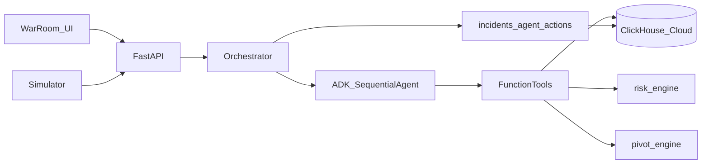

# On-Set War Room

**Agentic production incident command center** for the Google Cloud × ClickHouse (Agentic Cinema) partner track.

When **CAMERA-02** goes **DOWN** mid-shoot, the system:

1. Ingests the event into **ClickHouse Cloud**
2. Runs a **Google ADK** multi-agent pipeline (`SequentialAgent`)
3. Scores risk and ranks a schedule pivot with **deterministic engines**
4. Surfaces the incident on a cinematic ops dashboard

**Core demo truth (Midnight Protocol seed):**

| Signal | Expected value |
|--------|----------------|
| Failed resource | `CAMERA-02` |
| Affected scenes | **43**, **48** |
| Risk | **HIGH** (~80) |
| Recommended pivot | **Scene 47** |

---

## Table of contents

- [Why this exists](#why-this-exists)
- [Architecture](#architecture)
- [Repository layout](#repository-layout)
- [Data model (ClickHouse)](#data-model-clickhouse)
- [Agent pipeline (Google ADK)](#agent-pipeline-google-adk)
- [Prerequisites](#prerequisites)
- [Quick start](#quick-start)
- [Demo script](#demo-script)
- [API reference](#api-reference)
- [Verification](#verification)
- [Design / frontend](#design--frontend)
- [Security notes](#security-notes)
- [Roadmap gaps](#roadmap-gaps)

---

## Why this exists

Film sets generate operational chaos: kit fails, cast slips, weather shifts. Producers need **seconds**, not spreadsheet archaeology.

On-Set War Room treats production telemetry as an investigative workflow:

- **ClickHouse** is the system of record (events, scenes, requirements, incidents, agent traces)
- **Google ADK + Gemini** orchestrates *which evidence to gather* and *how to narrate*
- **Deterministic Python engines** own scores and pivot ranking so the agent cannot invent scenes or override risk math

---

## Architecture

```text
┌─────────────────────────────────────────────────────────────────┐
│  React / Vite UI                                                │
│  /  landing (cinematic)     /war-room  ops console              │
└───────────────────────────────┬─────────────────────────────────┘
                                │  /api  /health  (Vite proxy)
┌───────────────────────────────▼─────────────────────────────────┐
│  FastAPI                                                        │
│  events · simulate · incidents · agent · production health      │
│                         │                                       │
│              orchestrator.run_pipeline()                        │
│                         │                                       │
│              Google ADK Runner + SequentialAgent                │
│              Monitor → Investigator → Impact → Narrator         │
│                         │                                       │
│              FunctionTools ──► ClickHouse queries               │
│                            ──► risk_engine / pivot_engine       │
└───────────────────────────────┬─────────────────────────────────┘
                                │  clickhouse-connect (HTTPS)
┌───────────────────────────────▼─────────────────────────────────┐
│  ClickHouse Cloud                                               │
│  productions · scenes · scene_requirements                      │
│  resource_status_events · incidents · agent_actions             │
└─────────────────────────────────────────────────────────────────┘
```



### Runtime modes

| Mode | When | Behavior |
|------|------|----------|
| `live` | Valid `GOOGLE_API_KEY` / `GEMINI_API_KEY` | Real ADK `Runner` + Gemini LLM turns + tools |
| `tools_choreography` | No key, or live LLM error | Same ADK agent/tool graph; tools execute in order without LLM |

`/health/adk` reports `mode`, `live_llm`, and `api_key_present`.

**Guardrail:** After ADK runs, the orchestrator **re-materializes** findings / risk / pivot from the same FunctionTools so demo assertions stay stable (43/48 → HIGH → 47). Narration comes from the ADK narrator when available.

---

## Repository layout

```text
on-set-war-room/
├── backend/                 # FastAPI + Google ADK
│   └── app/
│       ├── agents/          # SequentialAgent, Runner, FunctionTools, orchestrator
│       ├── api/             # HTTP routes
│       ├── integrations/    # ClickHouse client, Gemini/ADK health helpers
│       ├── schemas/         # Pydantic models
│       └── services/        # event_service, risk_engine, pivot_engine
├── frontend/                # React + Vite + Tailwind landing + war room
├── clickhouse/
│   ├── schema/              # DDL
│   ├── seed/                # Midnight Protocol demo data
│   └── sample_queries.sql
├── simulator/               # Scenario JSON + event_generator.py
├── scripts/                 # apply_clickhouse, verify_mvp, verify_ingestion
├── docs/implementation-plan.md
└── .env.example
```

---

## Data model (ClickHouse)

Database: `on_set_war_room` (configurable via `CLICKHOUSE_DATABASE`).

| Table | Role |
|-------|------|
| `productions` | Production metadata (e.g. Midnight Protocol) |
| `scenes` | Call sheet windows, location, status |
| `scene_requirements` | Scene ↔ equipment/crew/location dependencies |
| `resource_status_events` | Live ingest stream (CAMERA-02 DOWN, etc.) |
| `incidents` | Persisted investigation outcomes + narrative + timeline JSON |
| `agent_actions` | Per-step / tool observability rows |

Seed narrative is intentional, not random: **CAMERA-02** is required by scenes **43** and **48**; scene **47** is a valid alternative that does not need CAMERA-02.

---

## Agent pipeline (Google ADK)

Root agent: `war_room_pipeline` (`SequentialAgent`) in `backend/app/agents/adk_app.py`.

| Order | Agent | Tools | Responsibility |
|------:|-------|-------|----------------|
| 1 | `monitor_agent` | `evaluate_event_risk` | Decide investigate vs skip |
| 2 | `investigator_agent` | `get_scenes_requiring_resource`, `get_scene_requirements`, `investigate_resource_event` | Gather ClickHouse evidence |
| 3 | `impact_agent` | `score_risk` | Call deterministic `risk_engine` |
| 4 | `narrator_agent` | `find_pivot_candidates` | Call `pivot_engine` + narrate grounded recommendation |

Entry points:

- `backend/app/agents/runner.py` — ADK `Runner` / tools choreography
- `backend/app/agents/orchestrator.py` — FastAPI bridge, timeline, incident store
- `backend/app/agents/tools.py` — JSON-serializable FunctionTools

---

## Prerequisites

- Python **3.10+**
- Node.js **20+**
- **ClickHouse Cloud** account (HTTPS; Docker not required)
- **Gemini API key** for live ADK LLM turns (optional but recommended)

---

## Quick start

### 1. Environment

```powershell
cd d:\on-war-room\on-set-war-room
copy .env.example .env
```

Fill in `.env` (never commit it):

```env
CLICKHOUSE_HOST=your-service.region.provider.clickhouse.cloud
CLICKHOUSE_PORT=8443
CLICKHOUSE_USERNAME=default
CLICKHOUSE_PASSWORD=...
CLICKHOUSE_DATABASE=on_set_war_room
CLICKHOUSE_SECURE=true

GOOGLE_API_KEY=...
GEMINI_MODEL=gemini-3.6-flash
```

### 2. Backend install + schema

```powershell
python -m pip install -e backend
python scripts/apply_clickhouse.py --schema
python scripts/apply_clickhouse.py --seed
```

### 3. Run API

```powershell
cd backend
python -m uvicorn app.main:app --reload --host 127.0.0.1 --port 8000
```

Health:

```powershell
curl.exe http://127.0.0.1:8000/health
curl.exe http://127.0.0.1:8000/health/clickhouse
curl.exe http://127.0.0.1:8000/health/adk
```

### 4. Run UI

```powershell
cd frontend
npm install
npx vite --host 127.0.0.1 --port 5173
```

| Surface | URL |
|---------|-----|
| Landing | http://127.0.0.1:5173/ |
| War Room | http://127.0.0.1:5173/war-room |
| API | http://127.0.0.1:8000 |

Vite proxies `/api` and `/health` to the backend.

---

## Demo script

With the API up:

```powershell
# Option A — simulator CLI
python simulator/event_generator.py --scenario camera_failure

# Option B — HTTP
curl.exe -X POST http://127.0.0.1:8000/api/simulate/camera_failure

# Inspect
curl.exe http://127.0.0.1:8000/api/incidents
python scripts/verify_mvp.py
```

Other scenarios:

```powershell
python simulator/event_generator.py --list
python simulator/event_generator.py --scenario actor_delay
python simulator/event_generator.py --scenario weather_issue
```

In the War Room UI: open **Enter console** / `/war-room`, run **camera_failure**, confirm HIGH / scenes 43 & 48 / pivot 47 and the agent timeline.

---

## API reference

| Method | Path | Purpose |
|--------|------|---------|
| `POST` | `/api/events` | Ingest resource event; auto-investigate DOWN/DEGRADED |
| `POST` | `/api/events/equipment` | Equipment-shaped ingest alias |
| `GET` | `/api/incidents` | List incidents |
| `GET` | `/api/incidents/{id}` | Full detail: evidence, pivot, narrative, timeline |
| `POST` | `/api/agent/investigate` | Re-run ADK pipeline for an `event_id` |
| `GET` | `/api/agent/actions/{id}` | Tool/action rows from ClickHouse |
| `GET` | `/api/agent/adk-status` | ADK health (also `/api/agent/gemini-status`) |
| `GET` | `/api/simulate/scenarios` | List canned scenarios |
| `POST` | `/api/simulate/{name}` | Ingest + investigate scenario |
| `GET` | `/api/production/health` | Dashboard aggregate |
| `GET` | `/health` | Liveness |
| `GET` | `/health/clickhouse` | ClickHouse ping + latency |
| `GET` | `/health/adk` | ADK import + key + mode |

---

## Verification

```powershell
python scripts/verify_mvp.py
```

Asserts for `camera_failure`:

- `risk_level == HIGH`
- `affected_scenes == [43, 48]`
- `recommended_pivot.scene_number == 47`
- Timeline includes ADK agent / tool steps

Related scripts:

- `scripts/verify_ingestion.py` — event landing in ClickHouse
- `scripts/verify_clickhouse.py` — connectivity + seed sanity
- `scripts/apply_clickhouse.py` — apply schema/seed

---

## Design / frontend

- Dark cinematic OLED aesthetic (landing + war room)
- Landing: brand lockup, hero media, GSAP / Framer Motion scroll (respects `prefers-reduced-motion`)
- War Room: live incidents, scenario runners, agent timeline, production health
- Tokens / notes under `design-system/on-set-war-room/`

---

## Security notes

- **Never commit** `.env`, API keys, or ClickHouse passwords
- `.gitignore` already excludes `.env` / `.env.local`
- Prefer rotating any key that was pasted into chat or screenshots
- Investigation tools query scoped ClickHouse data — not full-table dumps

---

## Roadmap gaps

- ClickHouse **MCP** bridge is stubbed (`integrations/mcp_client.py`); tools use `clickhouse-connect` directly today
- Hosted deploy (Cloud Run + public URL) and LICENSE file for hackathon submission
- Stronger Google Cloud / Vertex Agent Platform wiring beyond AI Studio-style API keys

Detailed phased plan: [docs/implementation-plan.md](docs/implementation-plan.md).

---

## License

Add a repository root `LICENSE` before public hackathon submission (e.g. Apache-2.0 or MIT).
